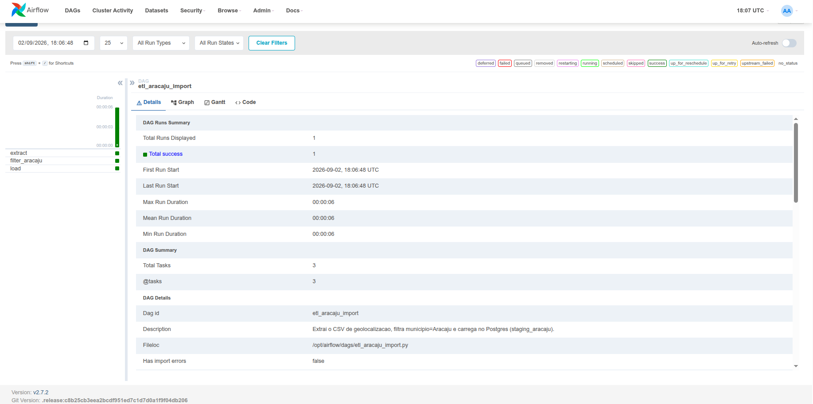
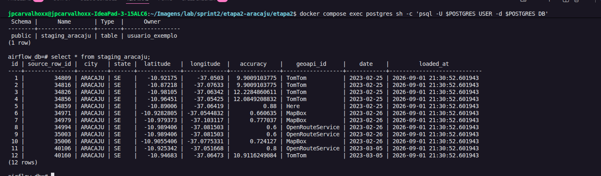

# Sprint 2 — ETL Aracaju com Apache Airflow

## Objetivo

Entender como o Airflow agenda e orquestra tarefas (DAGs) construindo um
pipeline simples de ponta a ponta: ler um CSV de geolocalização, filtrar
apenas os registros do município de **Aracaju** e carregar o resultado em
uma tabela no PostgreSQL.

Pré-requisito: o ambiente Airflow + PostgreSQL subido via Docker Compose na
**Sprint 1** já está funcional (containers `postgres` e `airflow` de pé,
UI acessível em `http://localhost:8080`).

## Estrutura do projeto

```
.
├── dags/
│   └── etl_aracaju_import.py     # DAG com as 3 tasks (extract -> filter -> load)
├── data/
│   └── dados_processo_seletivo.csv   # CSV de origem (50.000 linhas)
├── results/
│   ├── 01-dag-execucao-sucesso.png
│   └── 02-validacao-postgres-staging_aracaju.png
├── docker-compose.yml
├── .env / .env.example
└── README.md
```

## Identificação da coluna de município

Antes de codar, as colunas do CSV foram inspecionadas com
`pandas.read_csv(...).columns`, retornando:

```
['Unnamed: 0', 'city', 'state', 'latitude', 'longitude', 'accuracy', 'geoapi_id', 'date']
```

A coluna que representa o município é `city` (valores em maiúsculas, ex.:
`"ARACAJU"`).

> **Detalhe importante:** o dataset também contém o município **MARACAJU**,
> que contém a substring "ARACAJU". Por isso o filtro usa **igualdade
> exata** (`city.strip().upper() == "ARACAJU"`) em vez de `contains`/`LIKE
'%ARACAJU%'`, que erroneamente incluiria Maracaju no resultado.

## O DAG — `etl_aracaju_import`

DAG com 3 tasks encadeadas (TaskFlow API), disparo manual
(`schedule=None`), localizado em `dags/etl_aracaju_import.py`:

| Task             | Função                                                                                                                                                                                                            |
| ---------------- | ----------------------------------------------------------------------------------------------------------------------------------------------------------------------------------------------------------------- |
| `extract`        | Lê o CSV local (`/opt/airflow/data/dados_processo_seletivo.csv`) — ou baixa de uma URL, se a Airflow Variable `aracaju_csv_url` estiver configurada. Retorna apenas o caminho do arquivo via XCom.                |
| `filter_aracaju` | Lê o CSV, filtra as linhas com `city == "ARACAJU"` (comparação exata, case-insensitive) e retorna os registros filtrados via XCom.                                                                                |
| `load`           | Conecta ao PostgreSQL via `psycopg2`, cria a tabela `staging_aracaju` (`CREATE TABLE IF NOT EXISTS`), limpa dados de execuções anteriores (`TRUNCATE`, para reruns idempotentes) e insere os registros filtrados. |

Schema da tabela `staging_aracaju`:

```sql
CREATE TABLE IF NOT EXISTS staging_aracaju (
    id SERIAL PRIMARY KEY,
    source_row_id INTEGER,
    city TEXT,
    state TEXT,
    latitude DOUBLE PRECISION,
    longitude DOUBLE PRECISION,
    accuracy DOUBLE PRECISION,
    geoapi_id TEXT,
    date DATE,
    loaded_at TIMESTAMP DEFAULT now()
);
```

## Como executar

```bash
docker compose up -d
docker compose logs -f airflow   # aguardar scheduler/webserver subirem
```

1. Acessar `http://localhost:8080` e logar (usuário `admin`, senha definida
   no `.env` ou obtida com
   `docker exec -it <container_airflow> cat /opt/airflow/standalone_admin_password.txt`).
2. Localizar o DAG `etl_aracaju_import`, ativar o toggle e clicar em
   **Trigger DAG** (▶).
3. Acompanhar as 3 tasks (`extract` → `filter_aracaju` → `load`) ficarem
   verdes (success) no Grid/Graph.

Para inspecionar o banco visualmente, o projeto também sobe um **pgAdmin**
(`http://localhost:5050`, credenciais no `.env`) como alternativa ao
`psql` via terminal.

## Evidências de execução

### 1. Execução do DAG com sucesso na UI do Airflow



As 3 tasks (`extract`, `filter_aracaju`, `load`) aparecem em verde, com
`Total success: 1` no resumo da execução (`DAG Runs Summary`) e `Has import
errors: false`.

### 2. Validação da tabela `staging_aracaju` no PostgreSQL



Consulta rodada dentro do container do Postgres
(`docker compose exec postgres psql ...`):

```sql
SELECT * FROM staging_aracaju;
```

Resultado: **12 linhas**, todas com `city = ARACAJU` e `state = SE`.

## Critério de aceite

| Critério                                                  | Resultado                                             |
| --------------------------------------------------------- | ----------------------------------------------------- |
| Tabela `staging_aracaju` contém somente linhas de Aracaju | ✅ 12/12 linhas com `city = ARACAJU`                  |
| Número de linhas menor que o total do CSV original        | ✅ 12 linhas (staging) < 50.000 linhas (CSV original) |
| DAG executado sem erros pela UI do Airflow                | ✅ 3/3 tasks com status `success`                     |

## Notas técnicas / decisões de design

- **Filtro por igualdade exata, não `contains`**: evita capturar
  "MARACAJU" ao filtrar por "ARACAJU" (ver seção de identificação da
  coluna, acima).
- **Idempotência**: a task `load` faz `TRUNCATE` antes do `INSERT`, então
  reexecutar o DAG várias vezes não duplica linhas na tabela de staging.
- **XCom leve**: a task `extract` passa apenas o _caminho_ do arquivo entre
  tasks (não o CSV inteiro de 50 mil linhas), e só a task `filter_aracaju`
  carrega o dataset completo em memória — o XCom entre `filter_aracaju` e
  `load` carrega somente os ~12 registros já filtrados.
- **Dependências extras**: a imagem oficial `apache/airflow:2.7.2` não vem
  com `pandas`/`psycopg2-binary` pré-instalados; foram adicionados via
  `_PIP_ADDITIONAL_REQUIREMENTS` no `docker-compose.yml` (abordagem válida
  para ambiente de estudo/dev; para produção o recomendado seria build de
  imagem customizada).
