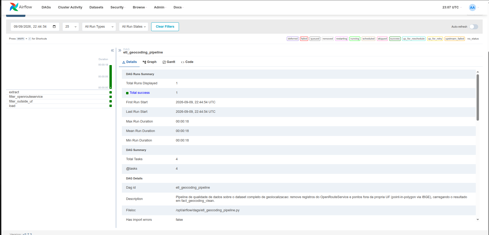
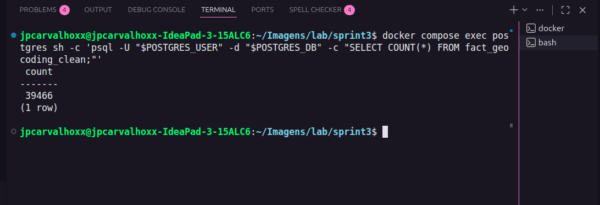

# Sprint 3 — Pipeline de Qualidade de Dados (`etl_geocoding_pipeline`)

Pipeline de qualidade de dados real sobre o **dataset completo** de
geolocalização (50.000 linhas, todas as UFs), que extrai o CSV, remove
registros inválidos por dois critérios diferentes e carrega o resultado
tratado na tabela `fact_geocoding_clean` no PostgreSQL.

DAG: `dags/etl_geocoding_pipeline.py`

---

## 1. Pré-requisitos

- Docker + Docker Compose instalados.
- Sprint 1 (Airflow + Postgres) já validada como base deste ambiente.
- Malha Territorial do IBGE (`BR_Municipios_2025`) extraída dentro de
  `./geo` — ver `geo/README.md`. O `.shp` tem ~300 MB e por isso **não é
  versionado** no repositório; cada ambiente precisa extraí-lo localmente
  uma vez.

Estrutura esperada antes de subir o ambiente:

```
.
├── dags/etl_geocoding_pipeline.py
├── data/dados_processo_seletivo.csv
├── geo/
│   ├── BR_Municipios_2025.shp/.shx/.dbf/.prj/.cpg/.qmd
│   └── uf_cache/                      # gerado automaticamente no 1º run
├── Dockerfile
├── requirements.txt
├── docker-compose.yml
└── .env
```

---

## 2. Permissões da pasta `geo/`

O container do Airflow roda com um usuário próprio (UID diferente do seu
usuário local) e precisa ter permissão de **escrita** em `./geo`, pois a
task `filter_outside_uf` grava o cache dos polígonos de UF em
`geo/uf_cache/uf_polygons.geojson` na primeira execução. Se a pasta foi
criada/extraída com permissões restritivas, a task falha com
`PermissionError`.

Antes do primeiro `docker compose up`, rode a partir da raiz do projeto:

```bash
chmod -R 777 ./geo
```

> Isso é adequado para ambiente local/estudo. Em produção, o ideal seria
> ajustar o `AIRFLOW_UID` do `.env` para bater com o dono real da pasta em
> vez de abrir 777 para todo mundo.

Se depois de subir o ambiente a pasta `geo/uf_cache/` acabar sendo criada
pelo container com outro dono e você não conseguir mais escrever nela pelo
host, repita o `chmod -R 777 ./geo` (ou `sudo chmod -R 777 ./geo`).

---

## 3. Build da imagem e comandos Docker

Esta sprint fixa as versões de `geopandas`/`fiona`/`shapely` em uma imagem
customizada (`Dockerfile` + `requirements.txt`) em vez de usar
`_PIP_ADDITIONAL_REQUIREMENTS` (que reinstala pacotes sem versão fixada a
cada start do container — causa de erros como `AttributeError: module
'fiona' has no attribute 'path'` entre execuções).

```bash
# 1) Build da imagem custom do Airflow (roda o pip install pinado do requirements.txt)
docker compose build

# 2) Subir os containers (postgres, pgadmin, airflow) em background
docker compose up -d

# 3) Acompanhar os logs até o scheduler/webserver ficarem prontos
docker compose logs -f airflow
```

### Acessos

| Serviço      | URL                                                           | Login                                                                              |
| ------------ | ------------------------------------------------------------- | ---------------------------------------------------------------------------------- |
| **Airflow**  | [http://localhost:8080](http://localhost:8080)                | usuário/senha do `.env` (`AIRFLOW_USER` / `AIRFLOW_PASSWORD`)                      |
| **pgAdmin**  | [http://localhost:5050](http://localhost:5050)                | e-mail/senha do `.env` (`PGADMIN_DEFAULT_EMAIL` / `PGADMIN_DEFAULT_PASSWORD`)      |
| **Postgres** | `localhost:5433` (fora do Docker, ex. via DBeaver/psql local) | usuário/senha/db do `.env` (`POSTGRES_USER` / `POSTGRES_PASSWORD` / `POSTGRES_DB`) |

> No pgAdmin, ao cadastrar o servidor pela primeira vez, use como **Host**
> o nome do serviço `postgres` (não `localhost`) e porta `5432` — o
> pgAdmin está na mesma rede Docker do Postgres. A porta `5433` é só para
> acessar de **fora** do Docker (do seu host).

### Disparar a DAG

Pela UI: localizar `etl_geocoding_pipeline`, ativar o toggle e clicar em
**Trigger DAG** (▶).

Ou via CLI, direto no container:

```bash
docker compose exec airflow airflow dags trigger etl_geocoding_pipeline
```

Acompanhar o status das 4 tasks (`extract` → `filter_openrouteservice` →
`filter_outside_uf` → `load`) no Grid/Graph. A primeira execução demora um
pouco mais em `filter_outside_uf` (gera o cache de polígonos de UF,
~40-50s); as seguintes usam o cache e são rápidas.

### Outros comandos úteis

```bash
# Reconstruir a imagem do zero (ex.: após mudar requirements.txt)
docker compose build --no-cache

# Ver logs de só um serviço
docker compose logs -f postgres

# Parar os containers sem apagar os dados
docker compose down

# Parar e apagar também o volume do Postgres (reset completo)
docker compose down -v
```

---

## 4. O que a pipeline faz

### 3.1 Extração (`extract`)

Lê `data/dados_processo_seletivo.csv` (50.000 linhas) e valida que o
arquivo existe. Só o **caminho** do arquivo trafega via XCom (dataset
grande demais para ir inteiro pelo XCom).

### 3.2 Transformação

**a) `filter_openrouteservice`** — remove as linhas geocodificadas via
**OpenRouteService** (coluna `geoapi_id`, comparação exata e
case-insensitive).

**b) `filter_outside_uf`** — remove pontos geograficamente fora da
própria UF declarada na linha (coluna `state`). Checagem geográfica real,
não textual:

1. Usa a Malha Territorial do IBGE (`BR_Municipios_2025`) montada em
   `./geo`.
2. Dissolve os municípios por `SIGLA_UF` → 1 polígono por UF (cacheado em
   `geo/uf_cache/uf_polygons.geojson`).
3. Para cada linha, testa se `(latitude, longitude)` cai **dentro** do
   polígono da UF que a própria linha declara (`gpd.sjoin(...,
predicate="within")`, point-in-polygon real via shapely).
4. Descarta linhas sem coordenada válida, fora do território nacional, ou
   cujo ponto caia geometricamente em UF diferente da declarada.

Cada etapa loga (`logger.info`) quantas linhas removeu. Exemplo real de
execução sobre o dataset completo:

```
Filtro OpenRouteService: 9998 linhas removidas de 50000. Restaram 40002 linhas.
Filtro geografico (UF): 536 linhas removidas de 40002
  [sem coordenada valida=0, fora do territorio nacional=2,
   ponto geometricamente em outra UF que nao a declarada=534].
  Restaram 39466 linhas.
```

### 3.3 Carga (`load`)

Conecta ao PostgreSQL via SQLAlchemy, cria (`CREATE TABLE IF NOT EXISTS`)
e popula `fact_geocoding_clean`, fazendo `TRUNCATE` antes do `INSERT` para
reruns idempotentes:

```sql
CREATE TABLE IF NOT EXISTS fact_geocoding_clean (
    id SERIAL PRIMARY KEY,
    source_row_id INTEGER,
    city TEXT,
    state TEXT,
    latitude DOUBLE PRECISION,
    longitude DOUBLE PRECISION,
    accuracy DOUBLE PRECISION,
    geoapi_id TEXT,
    date DATE,
    loaded_at TIMESTAMP DEFAULT now()
);
```

Resultado esperado, a partir do CSV atual: **39.466 linhas**.

---

## 5. Validar o resultado no Postgres

```bash
docker compose exec postgres sh -c 'psql -U "$POSTGRES_USER" -d "$POSTGRES_DB" -c "SELECT COUNT(*) FROM fact_geocoding_clean;"'
```

Outras queries úteis:

```sql
SELECT DISTINCT state FROM fact_geocoding_clean ORDER BY state;
SELECT COUNT(*) FROM fact_geocoding_clean WHERE geoapi_id = 'OpenRouteService';  -- deve ser 0
```

---

## 6. Configuração (Airflow Variables, todas opcionais)

| Variable                     | Default                                         | Descrição                                     |
| ---------------------------- | ----------------------------------------------- | --------------------------------------------- |
| `geocoding_csv_path`         | `/opt/airflow/data/dados_processo_seletivo.csv` | CSV de origem                                 |
| `ibge_municipios_shp_path`   | `/opt/airflow/geo/BR_Municipios_2025.shp`       | Shapefile de municípios do IBGE               |
| `uf_polygons_cache_path`     | `/opt/airflow/geo/uf_cache/uf_polygons.geojson` | Cache dos polígonos de UF (dissolve)          |
| `geocoding_intermediate_dir` | `/opt/airflow/data/_intermediate`               | Onde ficam os CSVs intermediários entre tasks |
| `geocoding_target_table`     | `fact_geocoding_clean`                          | Tabela de destino no Postgres                 |

---

## 7. Critérios de aceite

| Critério                                                           | Como verificar                                                                          |
| ------------------------------------------------------------------ | --------------------------------------------------------------------------------------- |
| Nenhuma linha com `geoapi_id = 'OpenRouteService'` na tabela final | `SELECT COUNT(*) FROM fact_geocoding_clean WHERE geoapi_id = 'OpenRouteService';` → `0` |
| Nenhum ponto fora do polígono da própria UF declarada              | evidenciado nos logs da task `filter_outside_uf`                                        |
| Tabela `fact_geocoding_clean` populada e menor que o CSV original  | `SELECT COUNT(*) FROM fact_geocoding_clean;` → `39466` (< 50.000)                       |
| DAG executado sem erros pela UI do Airflow                         | 4/4 tasks com status `success`                                                          |

---

## 8. Troubleshooting

**`AttributeError: module 'fiona' has no attribute 'path'`** ou
**`ImportError: Spatial indexes require either rtree or pygeos`** — versões
de `geopandas`/`fiona`/`shapely` incompatíveis entre si, normalmente
causadas por instalar essas libs via `_PIP_ADDITIONAL_REQUIREMENTS` sem
versão fixada (reinstala do zero, de forma não determinística, a cada
restart do container). Solução: usar o `Dockerfile`/`requirements.txt`
desta sprint (versões fixadas, build único) em vez da env var.

**`PermissionError` ao gravar `geo/uf_cache/uf_polygons.geojson`** — ver
seção 2 (`chmod -R 777 ./geo`).

**`FileNotFoundError: Shapefile do IBGE nao encontrado`** — confirme que
extraiu o `BR_Municipios_2025.zip` dentro de `./geo` (não em subpasta) e
que o bind mount `./geo:/opt/airflow/geo` está presente no
`docker-compose.yml`.

## 9. Evidências de execução

### 1. Execução do DAG com sucesso na UI do Airflow



As 4 tasks (`extract`, `filter_openrouterservise`,`filter_outside_uf` `load`) aparecem em verde, com
`Total success: 1` no resumo da execução (`DAG Runs Summary`) e `Has import
errors: false`.

### 2. Validação da tabela `fact_geocoding_clean` no PostgreSQL


